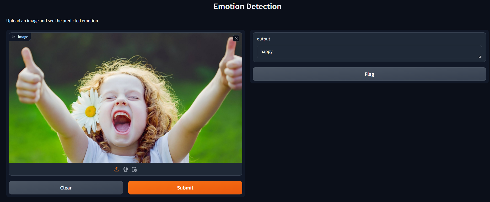

# Emotion Detection using CNN (Convolutional Neural Network)

## Project Overview

This project utilizes deep learning techniques to detect emotions from images using a Convolutional Neural Network (CNN). The final model implemented is ResNet50V2, trained on the FER-2013 dataset. The model predicts seven different emotions: angry, disgust, fear, happy, neutral, sad, and surprise.

## Dataset

The dataset used for training the model is the FER-2013 dataset, which can be found on Kaggle: [FER-2013 Dataset](https://www.kaggle.com/datasets/msambare/fer2013).

## Final Model

The final model chosen for this project is ResNet50V2. ResNet50V2 is a variant of the ResNet architecture that incorporates skip connections to ease the training process and improve accuracy.

## Applications

The project includes two applications for emotion detection:

1. **Gradio App (`gradio_app.py`)**:
   - This application allows users to upload an image to predict the emotion present in the image.
   - It provides an easy-to-use interface powered by Gradio, making it accessible for non-technical users.
   - To run the Gradio app for image-based emotion detection:
    ```
    python gradio_app.py
    ```


2. **OpenCV App (`emotion_detection_video.py`)**:
   - This application utilizes OpenCV (CV2) to perform real-time emotion detection using a live camera feed.
   - It also supports emotion detection on recorded video files, extending its usability beyond live camera inputs.
   - To run the OpenCV app for real-time emotion detection:

    ```
    python emotion_detection_video.py
    ```
This will start the application, which will capture video from the default camera. Press `q` to quit the application.


Project Organization
------------

   
    ├── README.md          <- The top-level README for developers using this project.
    ├── data
    │   └── raw            <- The original, immutable data dump.
    │
    ├── models             <- Trained and serialized models, model predictions, or model summaries
    │
    ├── requirements.txt   <- The requirements file for reproducing the analysis environment,
    │
    ├── src                <- Source code for use in this project.
    │   ├── __init__.py    <- Makes src a Python module
    │   │
    │   ├── data           <- Scripts to download or generate data
    │   │   └── clean_dataset.py
    │   │
    │   │
    │   ├── models         <- Scripts to train models and then use trained models to make
    │   │   │                 predictions
    │   │   ├── predict_model.py
    │   │   └── train_model.py
    │   │
--------

<p><small>Project based on the <a target="_blank" href="https://drivendata.github.io/cookiecutter-data-science/">cookiecutter data science project template</a>. #cookiecutterdatascience</small></p>
